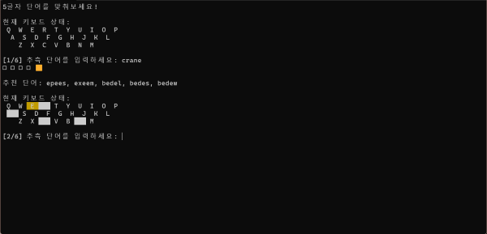

# Wordle Game in Python

This is a Python implementation of the popular word-guessing game, Wordle. The objective of the game is to guess a secret 5-letter word within six attempts. After each guess, you receive feedback indicating which letters are correct and in the correct position (🟩), which letters are correct but in the wrong position (🟨), and which letters are not in the word at all (⬜).

## Features

- Randomly selects a secret word from a predefined list.
- Provides feedback for each guess.
- Displays the current state of the keyboard with color-coded letters.
- Suggests similar words based on the current guess and feedback.

## How to Play

1. Run the script `wordle.py`.
2. Enter your guess for the 5-letter word.
3. Receive feedback and suggestions for similar words.
4. Continue guessing until you either guess the correct word or run out of attempts.

## Requirements

- Python 3.x
- A CSV file named `wordle.csv` containing a list of 5-letter words.

## Running the Game

> [!NOTE]
> You can also [download](https://github.com/Canachii/pywordle/releases/download/latest/wordle.exe) the executable version of the game from the releases section of the repository. This allows you to run the game without needing to install Python or any dependencies.

1. Ensure you have Python 3.x installed on your system.
2. Place the `wordle.csv` file in the same directory as `wordle.py`.
3. Run the script using the command:
    ```sh
    python wordle.py
    ```

## Example


.png)
